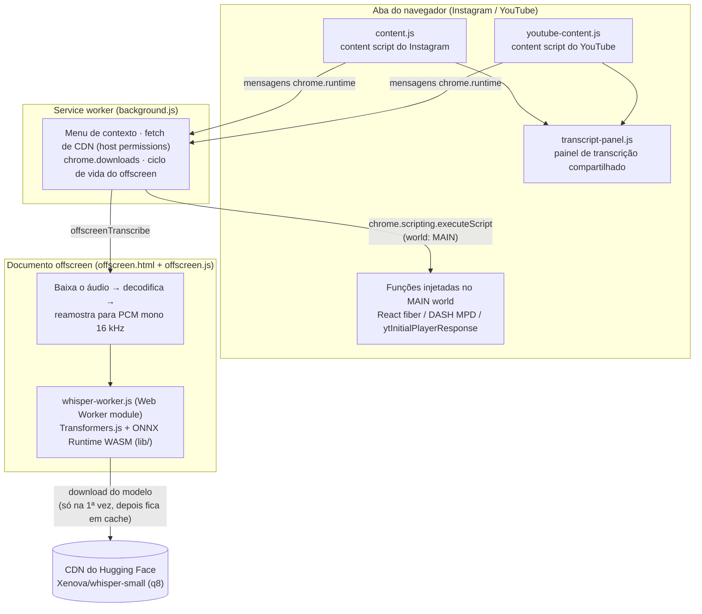

# Media Toolkit

> Copie imagens, baixe vídeos, extraia áudio e transcreva mídia do Instagram e do YouTube — direto no navegador, com IA rodando localmente.

[🇧🇷 Português](./LEIAME.md) | [🇺🇸 English](./README.md)

## Sobre

**Media Toolkit** (este repositório: `social-copy-plugin`) é uma extensão para Chrome construída em **Manifest V3** que adiciona utilitários de mídia às páginas do Instagram e do YouTube:

- No **Instagram**, injeta um botão de ações em posts, reels e stories para copiar imagens, baixar vídeos, extrair a trilha de áudio ou gerar uma transcrição.
- No **YouTube**, adiciona um botão de **Transcrição** nas páginas de vídeo que abre um painel lateral com as legendas — com busca, clique para navegar e cópia.

A transcrição no Instagram é feita por um modelo real de speech-to-text (**OpenAI Whisper**, via [Transformers.js](https://github.com/huggingface/transformers.js)) rodando **inteiramente dentro do seu navegador**. Sem API externa de transcrição, sem conta, sem nenhum servidor nosso envolvido.

## Funcionalidades

### Instagram (`content.js`)

- **Copiar imagem** — pelo menu de contexto ("Copiar imagem do Instagram") ou pelo botão injetado. A imagem é baixada, desenhada em um canvas, convertida para PNG e colocada na área de transferência.
- **Baixar vídeo (MP4)** — resolve a URL real da mídia lendo os internals do React do Instagram e o manifesto DASH (MPD) da página, e salva o MP4 completo via `chrome.downloads`.
- **Extrair áudio (WAV)** — baixa o stream de áudio, decodifica com a Web Audio API e salva como arquivo `.wav`.
- **Transcrever** — roda o Whisper localmente sobre o áudio do vídeo e exibe o resultado no painel de transcrição, com timestamps.

### YouTube (`youtube-content.js`)

- **Painel de transcrição** — lê as faixas de legenda nativas do vídeo (de `ytInitialPlayerResponse` / `captionTracks`, buscadas em formato JSON3) e as exibe no painel.
- **Troca de idioma** — quando o vídeo tem legendas em mais de um idioma, um seletor permite alternar entre as faixas.

### Painel de transcrição compartilhado (`transcript-panel.js`)

- **Busca** em todo o texto da transcrição.
- **Copiar tudo** — copia a transcrição inteira para a área de transferência com timestamps `[mm:ss]`.
- **Clique para navegar** — clicar em uma linha leva o vídeo para aquele momento.
- **Sincronização ao vivo** — a linha sendo falada é destacada conforme o vídeo toca.

## Arquitetura

O Manifest V3 impõe fronteiras rígidas (content scripts isolados, service worker sem DOM, restrições de CSP). A extensão é dividida em quatro contextos que cooperam entre si:

**Por que cada peça existe:**

- **Content scripts** rodam em um mundo isolado e, por isso, não enxergam o estado do React do Instagram nem as globais do player do YouTube. Eles cuidam apenas da UI (botões, painel) e da troca de mensagens.
- **Service worker** (`background.js`) usa `chrome.scripting.executeScript` com `world: "MAIN"` para executar pequenas funções dentro do contexto JavaScript da própria página — é assim que a extensão lê o React fiber / dados DASH MPD do Instagram e o `ytInitialPlayerResponse` do YouTube. Ele também faz os fetches cross-origin (cobertos pelas `host_permissions`), dispara downloads e gerencia o documento offscreen.
- **Documento offscreen** (`offscreen.html` + `offscreen.js`) existe porque um service worker MV3 não consegue criar um Web Worker module rodando WASM. A página offscreen baixa o áudio, decodifica e reamostra para mono 16 kHz, e hospeda o worker do Whisper.
- **Worker do Whisper** (`whisper-worker.js`) carrega o `Xenova/whisper-small` (quantizado em 8 bits) via Transformers.js sobre o backend WASM do ONNX Runtime (empacotado em `lib/`) e devolve os trechos transcritos com timestamps.

### Estrutura do projeto

| Arquivo | Papel |
|---|---|
| `manifest.json` | Manifesto MV3 ("Media Toolkit") |
| `background.js` | Service worker: menu de contexto, injeção no MAIN world, fetches de CDN, downloads, gestão do offscreen |
| `content.js` | Content script do Instagram (botões, fluxos de copiar/baixar/extrair/transcrever, encoder WAV) |
| `youtube-content.js` | Content script do YouTube (botão de transcrição, busca de legendas) |
| `transcript-panel.js` | Painel de transcrição compartilhado (busca, cópia, seek, destaque ao vivo) |
| `styles.css` / `youtube-styles.css` | Estilos por plataforma |
| `offscreen.html` / `offscreen.js` | Documento offscreen: fetch/decodificação/reamostragem do áudio + host do worker |
| `whisper-worker.js` | Web Worker module rodando o Whisper via Transformers.js |
| `lib/` | Transformers.js e binários WASM do ONNX Runtime empacotados |
| `icons/` | Ícones da extensão |

Não há etapa de build nem `package.json` — o repositório é carregado como está.

## Instalação

A extensão **ainda não está na Chrome Web Store**, então precisa ser carregada como "unpacked":

1. Clone ou baixe este repositório.
2. Abra `chrome://extensions` no Chrome (ou em um navegador recente baseado em Chromium).
3. Ative o **Modo do desenvolvedor** (chave no canto superior direito).
4. Clique em **Carregar sem compactação** ("Load unpacked") e selecione a pasta do repositório.
5. Abra o Instagram ou o YouTube e procure os botões injetados.

> **Nota sobre a primeira transcrição (Instagram):** o modelo Whisper é baixado do Hugging Face na primeira vez que você transcreve — um download único de algumas centenas de megabytes, que fica em cache no navegador. O painel mostra o progresso do download/carregamento. As transcrições seguintes começam bem mais rápido.

## Privacidade

- Todo o processamento — cópia de imagem, extração de áudio e transcrição por IA — acontece **localmente no seu navegador**.
- **Nada é enviado a nenhum servidor operado pelo autor.** Não há analytics, telemetria nem conta.
- As únicas requisições externas são: mídia baixada das CDNs do Instagram/YouTube (conteúdo que você já está vendo) e o download único do modelo Whisper na CDN do Hugging Face.
- As transcrições do YouTube usam as legendas que o próprio YouTube fornece; nenhum áudio sai da página.

## Status e Roadmap

**Status atual:** funcional, usado como ferramenta pessoal. Ainda não publicado na Chrome Web Store.

- [ ] Publicar na Chrome Web Store
- [ ] Seleção de idioma para a transcrição do Instagram (hoje o padrão é português)
- [ ] Melhorar o suporte a vídeos longos (a decodificação de áudio hoje é limitada a ~2 minutos, então vídeos mais longos do Instagram podem ser truncados na extração de áudio/transcrição)

## Aviso de uso responsável

Esta ferramenta é destinada a **uso pessoal e responsável**. Baixar mídia do Instagram ou do YouTube pode violar os Termos de Serviço dessas plataformas, e o conteúdo baixado pode estar protegido por direitos autorais. Você é o único responsável pelo uso desta extensão — respeite os direitos dos criadores, obtenha permissão quando necessário e não redistribua conteúdo que não é seu. Este projeto não tem afiliação, endosso ou vínculo com Instagram/Meta, YouTube/Google ou Hugging Face.
