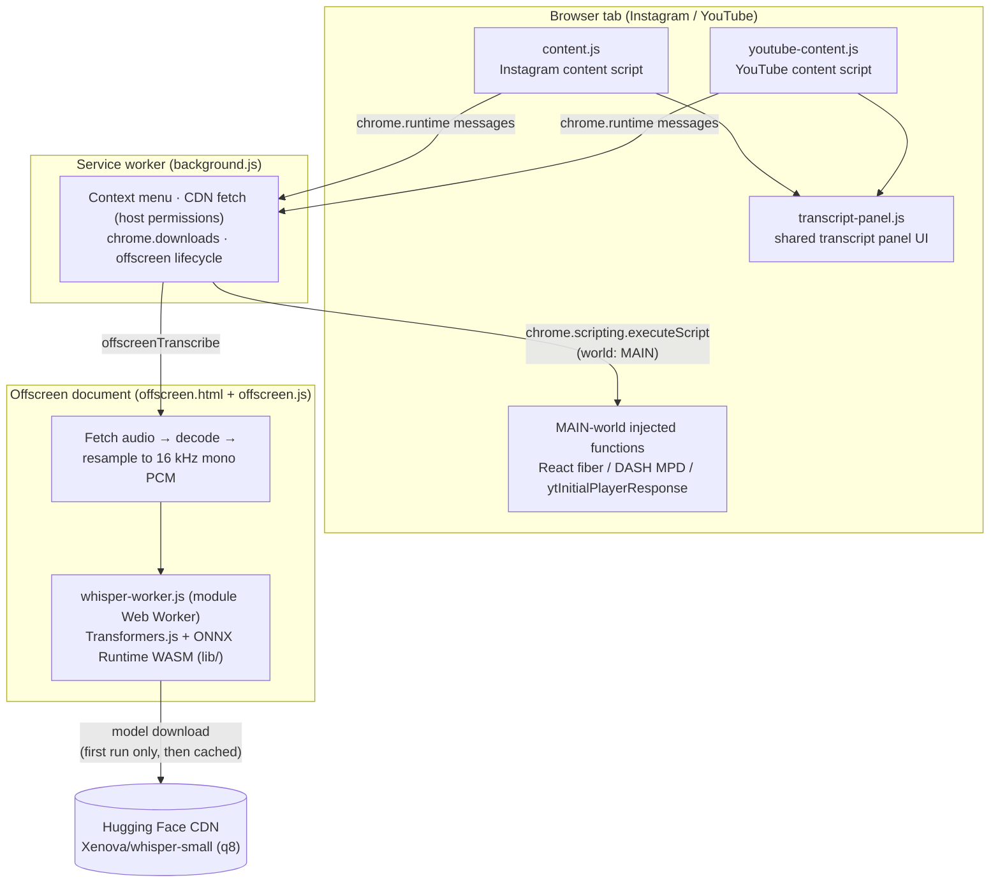

# Media Toolkit

> Copy images, download videos, extract audio and transcribe media from Instagram and YouTube — right in your browser, with on-device AI.

[🇧🇷 Português](./LEIAME.md) | [🇺🇸 English](./README.md)

## About

**Media Toolkit** (this repo: `social-copy-plugin`) is a Chrome extension built on **Manifest V3** that adds media utilities to Instagram and YouTube pages:

- On **Instagram**, it injects a small action button on posts, reels and stories so you can copy images, download videos, extract the audio track, or generate a transcript.
- On **YouTube**, it adds a **Transcript** button to watch pages that opens a side panel with the video's captions — searchable, clickable, and copyable.

Transcription on Instagram is done by a real speech-to-text model (**OpenAI Whisper**, via [Transformers.js](https://github.com/huggingface/transformers.js)) running **entirely inside your browser**. No external transcription API, no account, no server of ours involved.

## Features

### Instagram (`content.js`)

- **Copy image** — right-click context menu ("Copiar imagem do Instagram") or the injected button. The image is fetched, drawn to a canvas, converted to PNG, and placed on your clipboard.
- **Download video (MP4)** — resolves the real media URL by reading Instagram's React internals and DASH (MPD) manifest from the page, then saves the complete MP4 via `chrome.downloads`.
- **Extract audio (WAV)** — fetches the audio stream, decodes it with the Web Audio API, and saves it as a `.wav` file.
- **Transcribe** — runs Whisper locally on the video's audio and shows the result in the transcript panel, with timestamps.

### YouTube (`youtube-content.js`)

- **Transcript panel** — reads the video's native caption tracks (from `ytInitialPlayerResponse` / `captionTracks`, fetched in JSON3 format) and renders them in the panel.
- **Language switcher** — when the video has captions in more than one language, a dropdown lets you switch tracks.

### Shared transcript panel (`transcript-panel.js`)

- Full-text **search** across the transcript.
- **Copy all** — copies the whole transcript to the clipboard with `[mm:ss]` timestamps.
- **Click to seek** — clicking a line jumps the video to that moment.
- **Live sync** — the line currently being spoken is highlighted as the video plays.

## Architecture

Manifest V3 imposes strict boundaries (isolated content scripts, a service worker with no DOM, CSP restrictions). The extension is split into four cooperating contexts:

**Why each piece exists:**

- **Content scripts** run in an isolated world, so they cannot see Instagram's React state or YouTube's player globals. They handle UI (buttons, panel) and messaging only.
- **Service worker** (`background.js`) uses `chrome.scripting.executeScript` with `world: "MAIN"` to run small functions inside the page's own JavaScript context — that is how the extension reads Instagram's React fiber / DASH MPD data and YouTube's `ytInitialPlayerResponse`. It also performs cross-origin fetches (covered by `host_permissions`), triggers downloads, and manages the offscreen document.
- **Offscreen document** (`offscreen.html` + `offscreen.js`) exists because an MV3 service worker cannot spawn a module Web Worker running WASM. The offscreen page fetches the audio, decodes and resamples it to 16 kHz mono, and hosts the Whisper worker.
- **Whisper worker** (`whisper-worker.js`) loads `Xenova/whisper-small` (8-bit quantized) through Transformers.js on the ONNX Runtime WASM backend (vendored in `lib/`), and returns timestamped transcript chunks.

### Project layout

| File | Role |
|---|---|
| `manifest.json` | MV3 manifest ("Media Toolkit") |
| `background.js` | Service worker: context menu, MAIN-world injection, CDN fetches, downloads, offscreen management |
| `content.js` | Instagram content script (buttons, copy/download/extract/transcribe flows, WAV encoder) |
| `youtube-content.js` | YouTube content script (transcript button, caption fetching) |
| `transcript-panel.js` | Shared transcript panel (search, copy, seek, live highlight) |
| `styles.css` / `youtube-styles.css` | Styles per platform |
| `offscreen.html` / `offscreen.js` | Offscreen document: audio fetch/decode/resample + worker host |
| `whisper-worker.js` | Module Web Worker running Whisper via Transformers.js |
| `lib/` | Vendored Transformers.js and ONNX Runtime WASM binaries |
| `icons/` | Extension icons |

There is no build step and no `package.json` — the repository is loaded as-is.

## Installation

The extension is **not yet on the Chrome Web Store**, so it must be loaded unpacked:

1. Clone or download this repository.
2. Open `chrome://extensions` in Chrome (or a recent Chromium-based browser).
3. Enable **Developer mode** (top-right toggle).
4. Click **Load unpacked** and select the repository folder.
5. Open Instagram or YouTube and look for the injected buttons.

> **Note on the first transcription (Instagram):** the Whisper model is downloaded from Hugging Face the first time you transcribe — a one-time download of a few hundred megabytes, cached by the browser afterwards. The panel shows download/loading progress. Subsequent transcriptions start much faster.

## Privacy

- All processing — image copying, audio extraction, and AI transcription — happens **locally in your browser**.
- **Nothing is ever sent to any server operated by the author.** There is no analytics, telemetry, or account.
- The only external network requests are: media fetched from Instagram/YouTube CDNs (content you are already viewing) and the one-time Whisper model download from the Hugging Face CDN.
- YouTube transcripts use the captions YouTube itself provides; no audio leaves the page.

## Status & Roadmap

**Current status:** functional, used as a personal tool. Not yet published on the Chrome Web Store.

- [ ] Publish on the Chrome Web Store
- [ ] Language selection for Instagram transcription (currently defaults to Portuguese)
- [ ] Handle long videos better (audio decoding is currently capped at ~2 minutes, so longer Instagram videos may be truncated for audio extraction/transcription)

## Disclaimer

This tool is intended for **personal and responsible use**. Downloading media from Instagram or YouTube may violate those platforms' Terms of Service, and the content you download may be protected by copyright. You are solely responsible for how you use this extension — respect creators' rights, obtain permission where required, and do not redistribute content that is not yours. This project is not affiliated with, endorsed by, or connected to Instagram/Meta, YouTube/Google, or Hugging Face.
